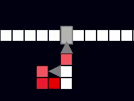

# Zápočtový program Václav Krňák
toto je zápočtový program na progrmování NPRG030-062
jedná se o celulární automat na simulaci elektrických obvodů 
> **Motivace:** Chtěl bych ukázat jak jednoduchá logika tranzistorů a diod dokáže vytvořt koplexní obvod

# Spouštění programu
program se spustí z příkazové řádky příkazem `python main.py` 

> požadavek pro spuštění programu je mít obrazovky s rozlišení aspoň 1800 na 1000, jinak je třeba zmenit řadek self.screen = pygame.display.set_mode((x,y)) v soubour main.py na požadované hodnoty

# Uživatelská dokumentace
## Koncept
Jedná se o diskrétní simulaci světa, tudíž simulace probíhá v krocích.
Svět simulace je rozdělen na čtvercovou mřížku a v každém čtverečku může být nějaká buňka, která ovlivňuje svoje 4 sousedy.
Buňky muhou být buď žívé nebo mrtvé, základní myšlenkou simulace je že buňka, která je živá oživý všechny své neživé sousedy. Ty pak v příštím kroku simulace udělaj to samé.

## Ovládání
Buňky do jednotlivých políček můžeme vkládat klikáním levého tlačítka myši.
K výběru typu buňky slouží výběrové kolečko, které se otevře stisknutím "e" a zavře stiknutím stejného tlačítka nebo vybraním buňky pomocí kliknutí myši.
Logika některých buňek se může měnit na základe jejich orientace, kterou lze změnít stisknutím "r".
Jakou buňky a s jakou orientací vkládáme slouží rychlý náhled, který je zobrazen pod ukazateleme myši.
Pro lepší orinetaci ve světě můžeme koleček přibližovat a oddalovat náhled a pravým tlačítkem myši ho zase posouvat.

## Buňky 
### Wire

Buňka **wire** neobsahuje žádnou specilání logiku. Pokud je **wire** živý, ožívý své sousedy pokud je mrtvá déle než čtyři kroky simulace, může být oživena.
Pro vizualizaci toho, kdy může být **wire** zase oživen slouží barevná indikace: červená znamená, že **wire** je živý, blednutí této barvy indukuje uplynutý čas, pokud je **wire** opět bílý, může být ožíven.

### Diode

Buňka **diode** slouží jako jednosměrný převaděč informace. Může nabývat 4 různých orientací a vždy vede proud pouze ve směru své orientace.
Logia **diode** je zařízená tak, že vede proud rychleji než obyčejný [**wire**](https://github.com/NejsemTonda/Logic-Board/new/main?readme=1#wire).
Jedna **diode** však nepředává informaci přimo druhé. Kombinaci **diode** a [**wire**](https://github.com/NejsemTonda/Logic-Board/new/main?readme=1#wire) může dosáhnout větší rychlosti, pokud je to potřeba

### Tranzistor

Buňka **Tranzistor** je hlavní logickou buňkou této simulace. Může nabívat 2 orientací a 2 stavů. 
Stav *blocked* kdy je **tranistor** na přístích 8 kroků simulace zablokovaný a nevede proud a stav *non blocked* kdy se tranzistor chová jako třída [**wire**](https://github.com/NejsemTonda/Logic-Board/new/main?readme=1#wire)
Při svislé orientaci a se **tranzistor** zablokuje, pokude byl oživen buňkou ze shora nebo zdola.
Při vodorovné orientaci tomu je obráceně.
Zda je **tranzistor** zablokovaný nebo ne indikuje jeho zabarvení: šedá znamená *blocked* a bíla *non blocked*

## Nástroje
### Remove

Tennto nástroj nalezneme ve [výběrovém kolečku](https://github.com/NejsemTonda/Logic-Board/new/main?readme=1#ovl%C3%A1d%C3%A1n%C3%AD).

Slouží k odstranění buňky 

### Revive

Tennto nástroj nalezneme ve [výběrovém kolečku](https://github.com/NejsemTonda/Logic-Board/new/main?readme=1#ovl%C3%A1d%C3%A1n%C3%AD).

Slouží k oživení buňky 

### Copy
Pomocí tohoto nástroje, můžeme kopírovat více buněk najedou. Pro jeho použítí stikněte klávesy `ctrl+c` a výběrovým čtvercem označte buňky, které chcete kopírovat.
Následně je můžete vložít pomocí nastroje [**Paste**](https://github.com/NejsemTonda/Logic-Board/new/main?readme=1#paste)

### Paste
Slouží pro vkládání více buňek najednou, pro použití stikněte `ctrl+v`. Objeví se náhled pro vložení buňky, levým tlačítkem myši buňky vložíte

### Store
Tímto nástrojem lze uložit skopírované buňky do textového souboru, ze kterého je lze později načíst pomocí nástroje [**Load**](https://github.com/NejsemTonda/Logic-Board/new/main?readme=1#load).
Po stisknutí kláves `ctrl+s` je třeba do příkazového řádku napsat název souboru, do kterého si přejete buňky uložit

### Load 
Tento nástroj slouží k načítaní dříve uložených souborů. Po stisknutí kláves `ctrl+l` se do příkazového řádku vypíší dostupné soubory a jejich pořadová čísla. 
Po zvolení pořadového čísla se na buňky ze souboru načtnou jako při používání nástroje [**Paste**](https://github.com/NejsemTonda/Logic-Board/new/main?readme=1#paste)
