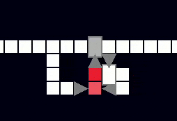
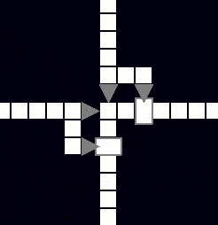
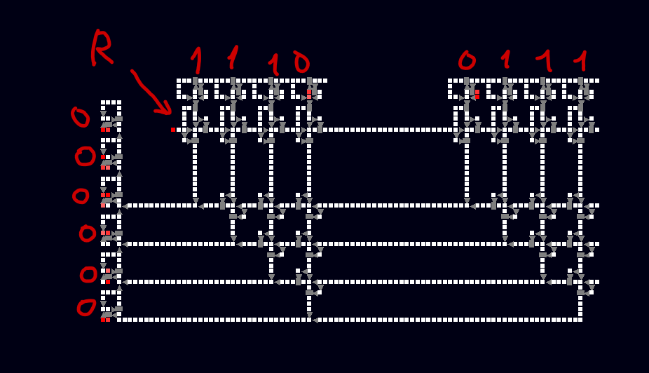
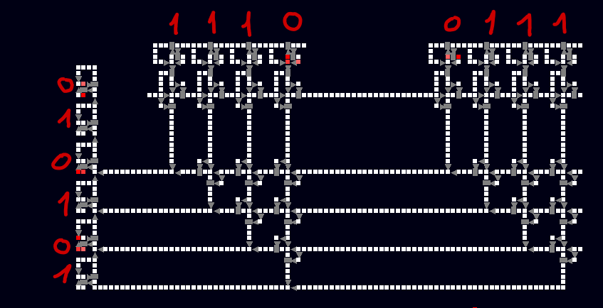

# Programátorská dokumentace 
Tato dokumentace obshaje: 
- [simulace světa](#simulace-světa)
  - funkce [`update()`](#update)
  - [třída `Unit` a její podtřídy](#třída-unit-a-její-podtřídy)
    - [`Unit.update()`](#unitupdate)
  - třída [`Vct`](#třída-vct)
- [zvládání inputů uživatel](#zvládání-inputů-uživatele)
  - [výběrové kolečko](#výběrové-kolečko)
- [vykreslování](#vykreslování)
  - funkce [`draw()`](#funkce-draw)
    - [`classes_models.py`](#classes_modelspy)
  - [`Camera`](#camera)
  - [rychlý náhled](#rychlý-náhled)
- [Ukládání a nahrávání](#)
- [Testy a příklady](#testy) 
  - binary counter
  - křižovatka 
  - calucator 
  
## Simulace světa
Jak už bylo řečeno jedná se o diskrétní simulaci světa. To znamená že se skládá z jednotlivých, navzájem se neovlivňujících kroků. 
Hlavní herní smyčka `run()` každou svojí iterací volá funkce `update()` a `draw()`. To znamená zhruba 120krát za sekundu.

### `update()`
Funkce se stará o to aby byly všechny inputy od uživatele aktuální a také každá osmý (lze přenastavit v `game.tickrate`) tick zavolá funkci `make_new_itteration()`, která updatuje všechny buňky v seznamu `classes.units`.
Také volá funkci `update()` u kamery, výběrového kolečka a inputhandler

### Třída `Unit` a její podtřídy
Z třídy `Unit`  dědí vlastnosti všechny ostatní buňky které se v simulaci nacházejí. 
Obsahuje několik slovníků a listů:
- slovník `Unit.units` v sobě drží všechny buňky simulace ve formátu: `(x,y): Unit()` kde x a y jsou souřadnice a `Unit` podtřída, která se na souřadnicích nachází.
- list `living_units` obsahuje souřadnice všech živých buněk, tedy buněk, na které je třeba volat `update()`
- list `new_itteration` obsahuje všechny buňky, které budou živé i v příští iteraci simulace
- a nějaké barvy a směry

Samotný Unit pak obsahuje:
- pozici
- život (0-3)
- sousedy (protože každá buňka může ovlivňovat pouze svoje 4 sousedy, je zbytečné aby každou iteraci procházela všechny buňky ve světě a místo toho si pamatuje jenom svoje 4 sousedící)

většina buněk má svoje vlastní funkce `update()` a `draw()` a tak z třídy `Unit` dědí pouze funkci `updateneighbors()`, která  zajišťuje to, aby buňka věděla o svých sousedech a její sousedi věděli o ní.

#### Unit.update()
Jak už bylo řečeno, funkce `update` se volá pouze u těch buněk, které jsou v seznamu `Unit.living_units`.
Každá buňka, která je živá se satrá o to aby byla i v příští iteraci a proto na konci každé `update()`funkce (pokud je třeba) musí být `self.new_itteration.append(self.pos)`
a pokud nějaká buňka oživuje jinou musí jí do listu `new_itteration` vložit.

### Třída `Vct`
Tuto třídu nalezneme v souboru `vector.py`. Jde o dvou dimenzionální vektory. Každý vektor má složku x a y, těmito složkami se také incializuje.
Implementované operace s vektory:
- sčítaní
- odčítání
- násobení skalárem
- dělení skalárem 
- porovnávání 
- modulení 
- zaokrouhlení 
- převedení na tuple (`Vct.tuple()` => `tuple`)
- velikost (`Vct.mag()` => `int`)

## Zvládání inputů uživatele 
O inputy od uživatel se stará třída `Handler` v souboru `inputhandler`.
Má hned několik užitečných proměnných, jako třeba `self.mousexy` ve které je uložený vektor pozice myši relativně vůči posunu a zvětšení kamery.
Další důležitou proměnnou je `self.activeunit`, zde je uložen identifikátor akce, která se stane po kliknutí myši, tyto identifikátory vyhodnocuje opět Handler.

Nejdůležitější je zde funkce `update()`, která mění stav proměnných v handleru a přidává či odebírá buňky ze světa

### Výběrové kolečko
Výběrové kolečko slouží jako vizualizace výběru potřebné buňky. Žije ve třídě `Wheel` v souboru `selection_wheel.py`.
Má svůj vlastní povrch (`self.surface = pygame.surface()`, díky tomu může být kolečko např. průhledné).
`self.timer` slouží jako časovač, při zmáčknutí "**e**" ho Handler nastaví na 500, při hodnotách větších jak 450 se kolečko zvětšuje, při hodnotách menších než 50 se začne opět zmenšovat.
Při stisknutí myši se jako proměnná `Handler.activeunit` nastaví ta, která je nejblíže myši. 

## Vykreslování 
### Funkce `draw()`
Tato funkce je volaná hlavní herní smyčkou, říká všem objektům v simulaci aby zavolali svojí funkci `draw()`
Pokud buňky nemá funkci `draw()` vykreslí se jako třída `Unit()`.
#### `Classes_models.py`
Tento soubor obsahuje pouze pomocné funkce `draw()` pro všechny typy buněk, navíc ještě `draw()` pro remove tool a revive.
Tyto pomocné funkce se nám hodí například když chceme nějakou buňku vykreslit na libovolné pozici (jako napřiklad u výběrového kolečka) s libovolný zvětšení a posunem.
### `Camera`
Tato třída se nachází v souboru `camera.py` a drží dvě důležité hodnoty:  `self.pos` a `self.scale`.
`self.pos` slouží jako ofset pro vykreslování všech buněk ve světe. `self.scale` slouží k přibližování a oddalování (základní hodnota je nastavena na 20)
### rychlý náhled
Je v souboru `preview.py` a ukazuje `Handler.activeunit` na pozici `Handler.mousexy`

## Ukládání a nahrávání
O jakoukoliv práci se soubory se stará `Filehandler` v soubory `filehandler.py`. Obsahuje list `self.buffer`, ve kterém jsou uloženy buňky se kterými budeme moc dále pracovat. Buňky jsou zde uloženy jako listy ve tvaru `[(x,y), typ buňky, orientace]`.
Do bufferu se mouhou buď dostat pomocí funkce `save()`, ta vezme všechny buňky ve výběrovém čtverci (`self.units`) a ty do něj v příslušném tvaru uloží, nebo funkcí `load()`, která nahraje buňky ze zvoleného textového souboru.
Funkce `crop()` dělá to samé, ale označené buňky odstraní.
Výběrový čtverec se updatuje funkci `mark()` ta se volá pokud `Handler.activeunit == "copytool"`
Funkce `store_buffer()` pak uloží `self.buffer` do textového souboru s jménem z inputu v příkazovém řádku.

## Testy
Testy jsou předpřipravené textové soubory, nahrajeme je pomocí [**Load**](Logic-Board/README.md#load)
#### Repeater

Sebe oživující soustava. Oživí buňky vedle sebe každou pátou iteraci
#### Binary counter

Má jeden input a jeden output. Jakou output dá každý druhý input. Může být použit jako binární počítadlo
#### Crossway

Křižovatka, signál ze shora se nesmíchá se signálem ze zdola
#### Computer
Z těchto základní komponentů už můžeme sestavit nějaký větší projekt, já jsem dal dohromady sčítací obvod.

nahoře jsou dvě paměťové buňky, každá z nich dokáže uložit 4 bity, v bude po sečtení (**R**) zapsáná výsledek (LSB dole)

